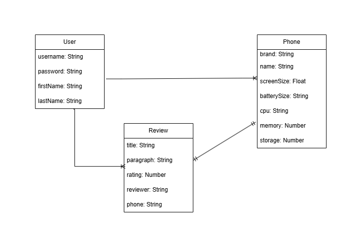
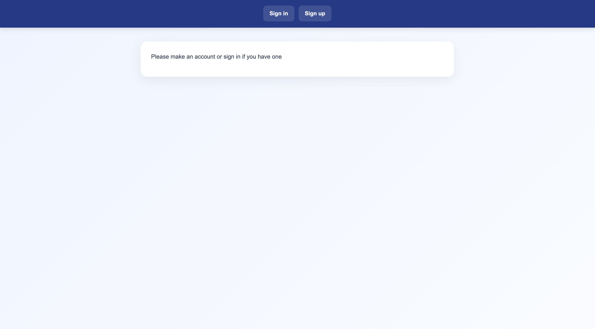
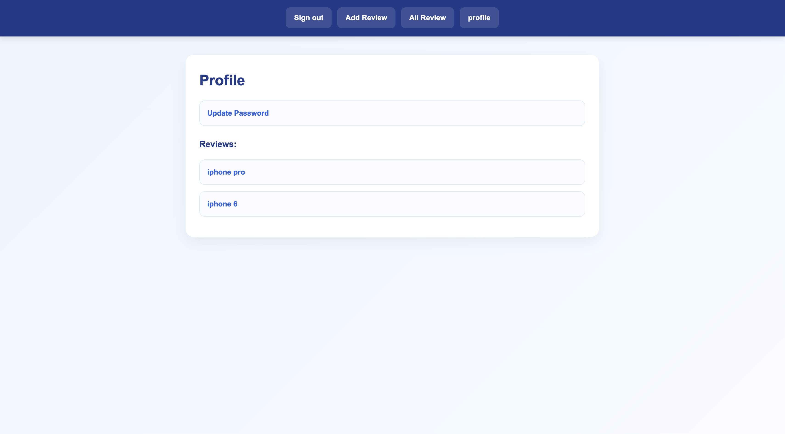
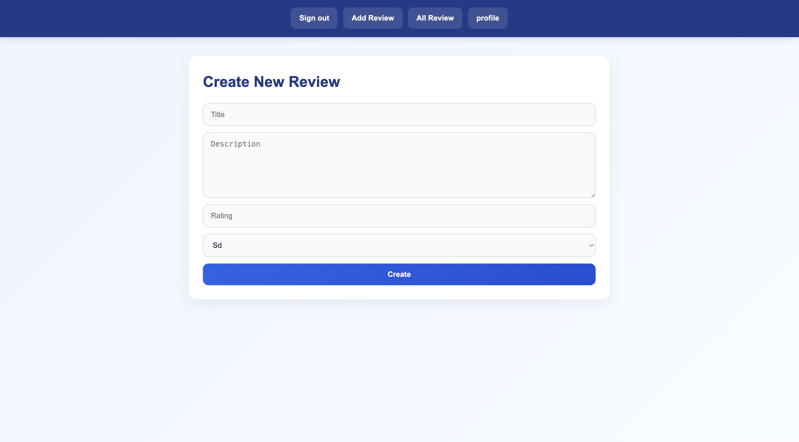

# GA-Project-2

## Date 2/26/2026 ##

### By: Hasan Mahfoodh - Ali Hasan ###

#### [Hasan's LinkedIn](www.linkedin.com/in/hasan-mahfoodh-84916b3a8) | [Hasan's GitHub](https://github.com/v7sn0) | [Ali's LinkedIn](https://www.linkedin.com/in/alihasan24/) | [Ali's GitHub](https://github.com/alooyu24) ####

***
### Description ###
A website that allows users to review phones and share their review.

***

### Technologies ###

* Node.js - Express
* EJS
* Mongoose - MongoDB

***

### Getting Started ###
  Create an account and then start writing a review about a phone that you used, and share it.

### Screenshots ###

#### Review page ####

#### Create review page ####

#### Home page ####

#### ER Diagram ####

***

#### First screenshot ####

#### Second screenshot ####

#### Third screenshot ####

***

### Task List ###
- [x] Create back end
- [x] Create EJS
