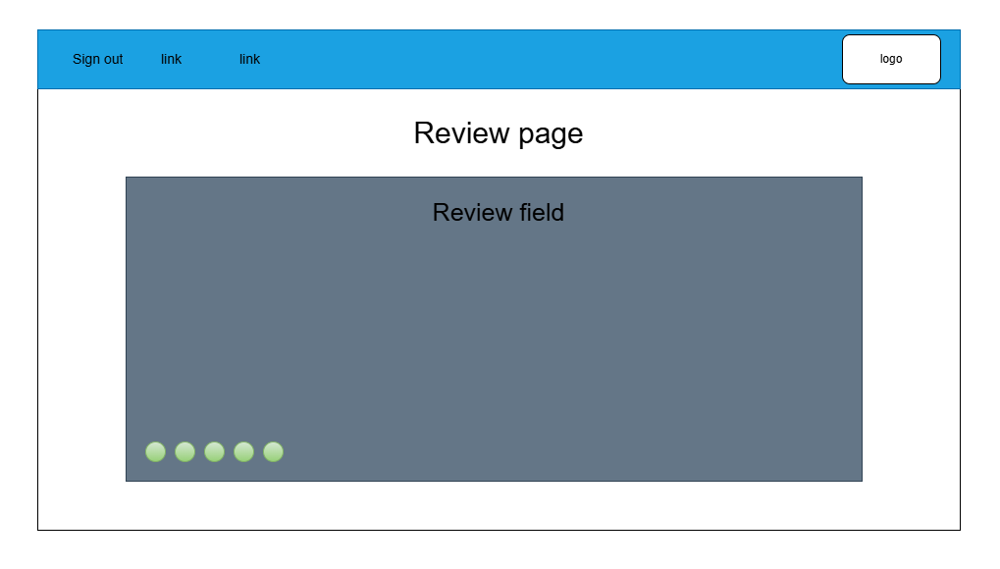
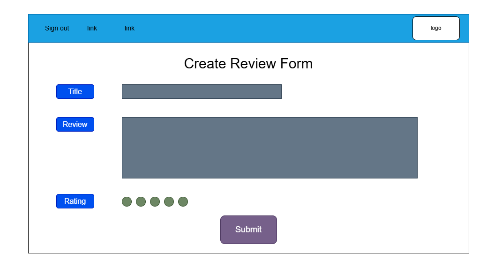
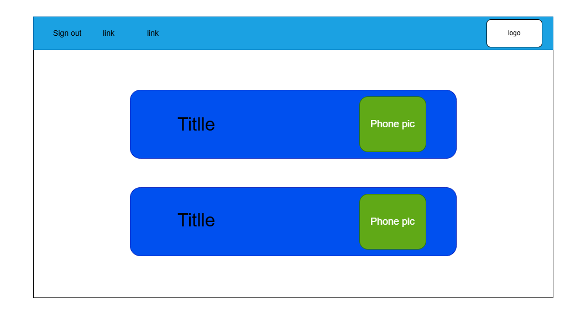

# GA-Project-2

## Date 2/26/2026 ##

### By: Hasan Mahfoodh - Ali Hasan ###

#### [LinkedIn](www.linkedin.com/in/hasan-mahfoodh-84916b3a8) | [GitHub](https://github.com/v7sn0) ####

***
### Description ###
A website that allows users to review phones and share their review.

***

### Technologies ###

* Node.js - Express
* EJS
* Mongoose - MongoDB

***

### Getting Started ###
  Empty for now.

### Screenshots ###

#### Reviw page ####

#### Create review page ####

#### Home page ####

***

### Task List ###
Empty for now.

### Credits ###

Empty for now.
